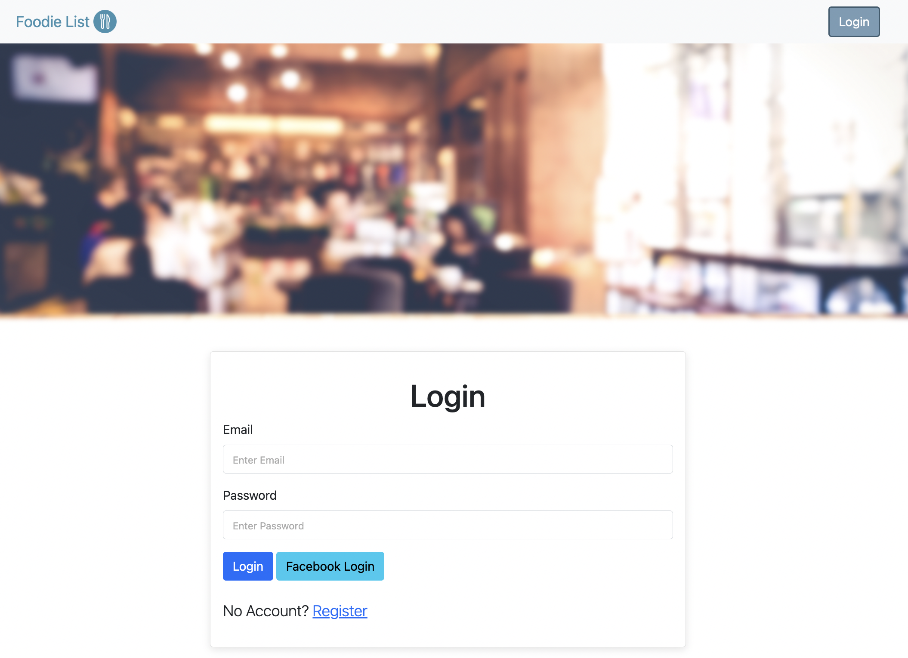

# Foodie Bucket List -V2：User login


## 📖 Introduction
This website is a Foodie Bucket List in Taipei which contains all restaurants’ addresses, phone numbers, categories, and ratings. Moreover, you can use the search bar to check certain restaurants and categories. Lastly, you can click one of the lists to view the detailed description of restaurants.

2/10 update: “Foodie Bucket List-V2：User login” add user login & register functions

## 🎮 Features
Users can overview all restaurants, including:

- Restaurant pictures
- Restaurant names
- Rating
- Categories

Users can view the detail of the restaurant, including:

- Restaurant names
- Categories
- Addresses and google map
- Phone numbers
- The detail of the description


Users can use the search bar to check certain restaurants and categories

- When it’s a typo, and cannot find any restaurant, it will display an error message

Users can add a new restaurant, including:

- Restaurant name
- Category
- Image link
- Addresses and google map
- Phone numbers
- Rating
- The detail of the description


Users can edit a new restaurant, including:

- Restaurant name
- Category
- Image link
- Addresses and google map
- Phone numbers
- Rating
- The detail of the description


Users can delete a restaurant from the list

- Reminder will show when click a delete button

[Version 2]

Users can register, login & logout

- One user has his/her own data in Foodie Bucket List
- navbar will change when different user login
- users can login via Facebook
- users’ password has been processed via bcrypt
- user will get warning messages if login or register error



## 🛠️ Installation
```
# Clone this repository
$ git clone https://github.com/Lilynews/xxxxx.git

# Confirmed the terminal is at the project
cd xxxxx

# Project setup
$ npm install

# add the file of .env, and set up the DB_URL
MONGODB_URL=mongodb+srv://<account>:<password>@cluster0.<xxxxx>.mongodb.net/<table>?retryWrites=true&w=majority

# Before active project, need to create seeder in DB, type
npm run seed

after setup, type
$ npm run start

# if the message shows like below, please open the web page and type the URL: http://localhost:3000, and you can enter this website.
"Express is listening on localhost:3000"
"mongodb connected!"

# To stop the project
ctrl + c
```

## 👩🏻‍💻 Tech/framework used
- VScode 1.73.1
- Express 4.16.4
- Express-handlebars 3.0.0
- Express-session: 1.17.1
- bootstrap 5.1.3
- font-awesome
- bcryptjs 2.4.3
- connect-flash 0.1.1
- method-override 3.0.0
- mongoose: 5.9.7
- passport 0.4.1
- passport-facebook 3.0.0
- passport-local 1.0.0

## 🗺️ Roadmap
- [x]  List of restaurants
    - [ ]  Connect Funyooo website (AC-HW-2-2-A13)
    - Details of each restaurant
        - [x]  Category, address, phone, description
        - [ ]  Embedded google map
        - [ ]  Embedded google review
    - Search bar
        - Foolproof design
            - [x]  when type space
            - [ ]  when a typo cannot be found
                - Edit views between search error and first login
            - [ ]  re-write search routes
        - [x]  Drop-down option by A → Z
        - [x]  Drop-down option by Z → A
        - [x]  Drop-down option by category
        - [x]  Drop-down option by location
- Front-end optimization
    - [x]  Tab name when switching different pages
    - [ ]  Fix certain page part
    - [ ]  Buttons can have hover effects
    - [ ]  Add some font-awesome icons
- Login
    - [ ]  Google login
    - [ ]  QR code login
    - [ ]  Forget password
- Warning message
    - [ ]  Login without email
    - [ ]  Register can show all messages at once
    - [ ]  Edit restaurant can show messages when the format does not match